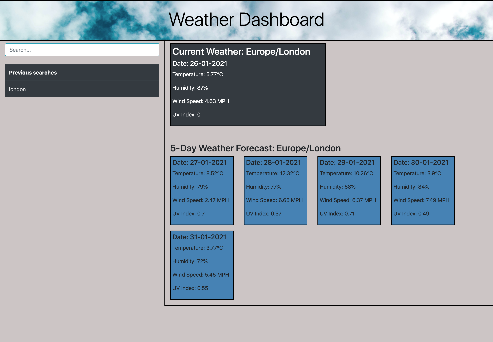

# Weather Dashboard
### Link to deployed application: https://mj-0001.github.io/weather-dashboard/
## Screenshot of deployed application:

## Languages and Libraries used
* JQuery
* AJAX
* HTML
* CSS
* Bootstrap CSS

## Purpose of application
The application utilises a Weather API (available at https://openweathermap.org/api#current)
to pull down weather data for European cities.
The user is able to specify the location in the search bar, and the application will
build the URL and return the data for that city with dynamic HTML injection.

