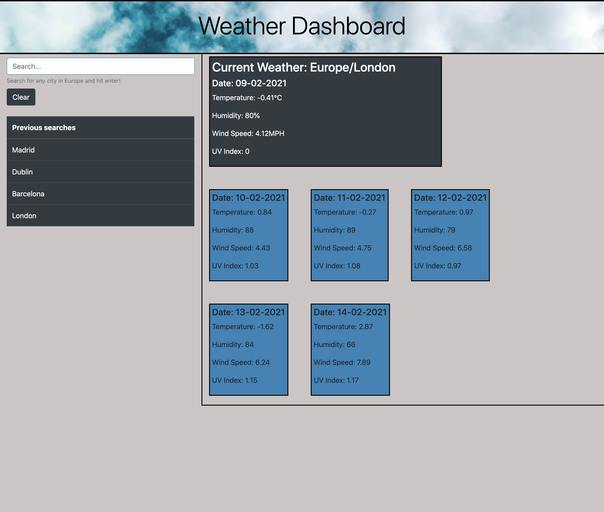

# Weather Dashboard API

# Table of Contents
- [Description](#description)
- [Installation](#installation)
- [Instructions](#instructions)
- [Credits](#credits)
- [Contributions](#contributions)
- [Tests](#tests)
- [Questions](#questions)
- [License](#license)
---
## Screenshot of deployed application:


## Description:
```
The application utilises a Weather API 
(available at https://openweathermap.org/api#current) to pull
down weather data for European cities. The user is able to specify
the location in the search bar, and the application will build
the URL and return the data for that city. This is achieved using
dynamic HTML rendering.
```
---
## Installation:
```
No additional packages are required. The app itself uses
HTML5, CSS3 and jQuery.
```
---
## Instructions:
```
Enter a city in Europe and hit enter to view up-to-date weather information.
```
---
## Credits:
```
This work is my own.
```
---
## Contributions:
```
Please feel free to fork the repo.
```
---
## Tests:
```  
None
```

---
## Questions:  
```
If you have any questions please find my Github username and my email address below:  

* MJ-0001
* mejones92@gmail.com
```
---
## License:  

MIT  

  

https://opensource.org/licenses/MIT

---

